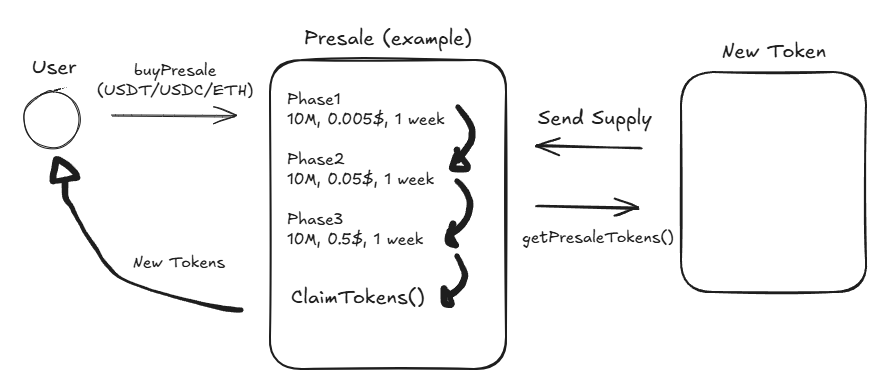

# 🚀 Presale Smart Contract

This smart contract facilitates a token presale with support for **USDT**, **USDC**, and **ETH**. It allows buyers to purchase presale tokens during a defined time window across multiple pricing phases. The contract uses **Chainlink’s decentralized price feed** to fetch the real-time ETH price, ensuring accurate USD-value calculations for ETH contributions.

## ✨ Key Features

- 🧪 **Fully tested with Foundry**, achieving 98%+ line and statement coverage.  
- 🔐 **Owner-managed** access and emergency controls.  
- 📊 **Chainlink Data Feed Integration** for real-time ETH/USD pricing.  
- 📈 **Phase-based pricing** with automatic progression based on time or token limits.  
- ⚠️ **Blacklist support** to exclude specific addresses.  
- 🎟️ **Token claiming** available post-sale.  

## ℹ️ How it Works

When a user buys tokens during the presale, the contract first checks that the presale is active and the user is not blacklisted. If paying with ETH, it fetches the real-time ETH/USD price via Chainlink to calculate the token amount; for stablecoins (USDT/USDC), it uses the fixed price set for the current phase. The user's claimable tokens are recorded, funds are sent to the designated receiver, and an event is emitted. After the presale ends, users can claim their allocated tokens.

## 🧩 Contract Overview

| Function                          | Description                                                                 |
|----------------------------------|-----------------------------------------------------------------------------|
| `buyPresaleWithStable()`         | Purchase tokens using USDT or USDC.                                        |
| `buyPresaleWithETH()`            | Purchase tokens using ETH; price fetched via Chainlink.                    |
| `claimTokens()`                  | Claim purchased tokens after presale ends.                                 |
| `getETHPrice()`                  | Returns current ETH/USD price from Chainlink price feed.                   |
| `getPresaleTokens()`             | Owner function to deposit tokens into the contract for distribution.       |
| `checkCurrentPhase()`            | Private function to update the phase based on time or amount sold.         |
| `blacklistUser()`                | Owner function to blacklist a user from participating.                     |
| `removeBlacklist()`              | Owner function to remove a user from the blacklist.                        |
| `emergencyWithdrawERC20()`      | Withdraw any ERC20 tokens from the contract (owner only).                  |
| `emergencyWithdrawETH()`        | Withdraw ETH from the contract in case of emergency (owner only).          |

---

## 📊  Testing Coverage (via `forge coverage`)

| File                | % Lines        | % Statements   | % Branches     | % Functions     |
|---------------------|----------------|----------------|----------------|-----------------|
| `src/Presale.sol`   | 98.46% (64/65) | 98.53% (67/68) | 76.92% (20/26) | 100.00% (11/11) |
| `test/Presale.t.sol`| 100.00% (2/2)  | 100.00% (1/1)  | 100.00% (0/0)  | 100.00% (1/1)   |
| **Total**           | **98.51% (66/67)** | **98.55% (68/69)** | **76.92% (20/26)** | **100.00% (12/12)** |

---

## 🛠 How to Use

### Deployment

Deploy the contract with the following parameters:

- `tokenAddress_`: ERC20 token being sold.
- `dataFeedAddress_`: Chainlink ETH/USD price feed address.
- `USDT_`, `USDC_`: Addresses for stablecoins.
- `fundsReceiver_`: Address where funds will be sent.
- `maxSellingAmount_`: Total tokens to be sold.
- `phases_`: Array of `[amount, price, time]` for each sale phase.
- `startTime_`, `endTime_`: Presale time window.

### Purchasing Tokens

- Use `buyPresaleWithStable(token, amount)` with USDT or USDC.
- Use `buyPresaleWithETH()` to buy with ETH; real-time conversion via Chainlink.

### Claiming Tokens

- Call `claimTokens()` **after** the presale ends to retrieve purchased tokens.

### Admin Functions

- Use `getPresaleTokens()` to deposit the tokens being sold.
- Use `blacklistUser()` or `removeBlacklist()` to manage participation.
- Use emergency withdraw functions if necessary.